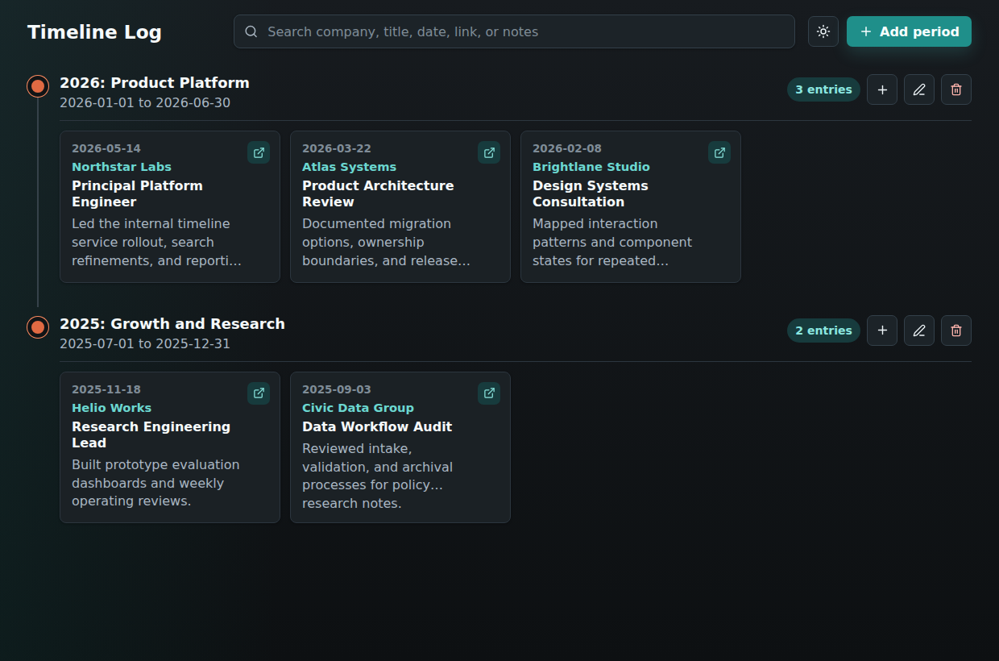
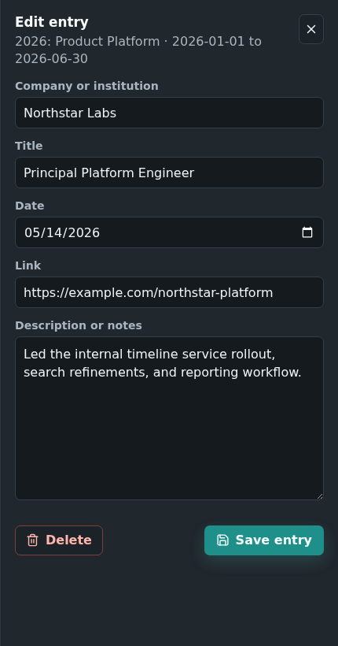

# Timeline Log

Timeline Log is a desktop app for keeping a dated history of companies, institutions, roles, projects, or other career-style entries. It groups entries into named periods, keeps the data in a local SQLite database, and provides search across entry details.

## Screenshots





## Features

- Create, edit, and delete timeline periods with start and end dates.
- Add dated entries inside each period with company/institution, title, link, and notes.
- Search by company, title, date, link, or notes.
- Keep entry dates constrained to their period range.
- Open saved HTTP(S) links through the operating system browser.
- Store data locally with SQLite and automatic schema setup.

## Tech Stack

- Electron for the desktop shell.
- React and Vite through `electron-vite` for the renderer.
- TypeScript across main, preload, renderer, and shared code.
- better-sqlite3 and Drizzle ORM for local persistence.
- Zod for validation.
- Vitest, Testing Library, and Playwright for tests.
- oxlint and Prettier for code quality.

## Requirements

- Node.js `>=20.19.0`
- pnpm `10.33.0`

If pnpm is not installed, enable it through Corepack:

```sh
corepack enable
corepack prepare pnpm@10.33.0 --activate
```

## Getting Started

Install dependencies:

```sh
pnpm install
```

Start the app in development mode:

```sh
pnpm dev
```

Build the app:

```sh
pnpm build
```

Package the Windows installer and portable executable:

```sh
pnpm package:win
```

Preview the built Electron app:

```sh
pnpm preview
```

## Scripts

| Command                   | Purpose                                                                             |
| ------------------------- | ----------------------------------------------------------------------------------- |
| `pnpm dev`                | Rebuild native Electron dependencies and start the Electron/Vite dev server.        |
| `pnpm build`              | Rebuild native Electron dependencies and build main, preload, and renderer bundles. |
| `pnpm screenshots:readme` | Build the app and regenerate the README screenshots.                                |
| `pnpm package:win`        | Build Windows x64 installer and portable executable artifacts.                      |
| `pnpm preview`            | Run the built app through `electron-vite preview`.                                  |
| `pnpm typecheck`          | Run TypeScript without emitting files.                                              |
| `pnpm lint`               | Run oxlint with warnings denied.                                                    |
| `pnpm format`             | Format the repository with Prettier.                                                |
| `pnpm format:check`       | Check Prettier formatting.                                                          |
| `pnpm test`               | Rebuild `better-sqlite3` for Node and run Vitest.                                   |
| `pnpm test:watch`         | Run Vitest in watch mode.                                                           |
| `pnpm e2e`                | Build the app and run Playwright Electron tests.                                    |

## Data Storage

By default, the app stores its SQLite database in Electron's user data directory as:

```text
timeline-log.sqlite
```

For development or tests, override the database path with `TIMELINE_LOG_DB_PATH`:

```sh
TIMELINE_LOG_DB_PATH=/tmp/timeline-log.sqlite pnpm dev
```

The database uses WAL mode and enables foreign keys. Period deletion cascades to entries. Schema setup currently lives in [src/main/db/migrations.ts](src/main/db/migrations.ts), while the Drizzle table definitions live in [src/main/db/schema.ts](src/main/db/schema.ts).

## Project Structure

```text
src/
  main/       Electron main process, database setup, IPC handlers
  preload/    Safe API exposed to the renderer through contextBridge
  renderer/   React UI and styles
  shared/     Shared API types, validation, channels, and date helpers
tests/
  e2e/        Playwright Electron tests
```

Key files:

- [src/main/index.ts](src/main/index.ts) wires up the database, repository, IPC handlers, and main window.
- [src/main/db/repository.ts](src/main/db/repository.ts) owns timeline persistence and business rules.
- [src/preload/index.ts](src/preload/index.ts) exposes the typed `window.timeline` API.
- [src/renderer/App.tsx](src/renderer/App.tsx) coordinates timeline loading, search, dialogs, and panels.
- [src/shared/validation.ts](src/shared/validation.ts) defines input validation used across the app.

## Testing

Run unit and component tests:

```sh
pnpm test
```

Run end-to-end tests:

```sh
pnpm e2e
```

The Playwright test launches the built Electron app with an isolated temporary SQLite database via `TIMELINE_LOG_DB_PATH`.

## Windows Packaging

This repository includes a manually triggered GitHub Actions workflow named `Build Windows`. In GitHub, open the Actions tab, choose `Build Windows`, and run the workflow from the target branch. The completed run uploads a `timeline-log-windows-x64` artifact containing the Windows setup executable, portable executable, and electron-builder metadata files.

## Native Dependency Notes

This project uses `better-sqlite3`, which must be rebuilt for the runtime that uses it:

- `pnpm rebuild:electron` rebuilds it for Electron.
- `pnpm rebuild:node` rebuilds it for Node-based tests.

The main scripts call these rebuild commands where needed, so manual rebuilds are usually only necessary after dependency or runtime changes.

## License

MIT. See [LICENSE](LICENSE).
